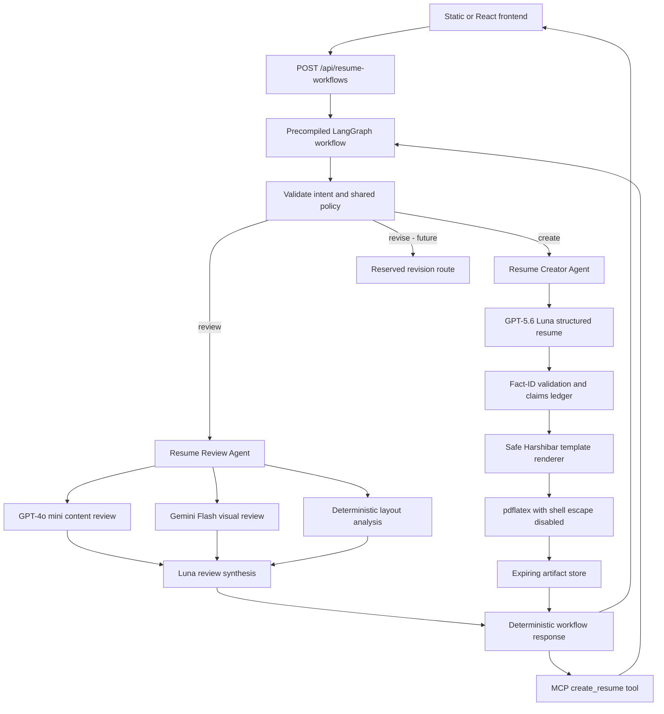
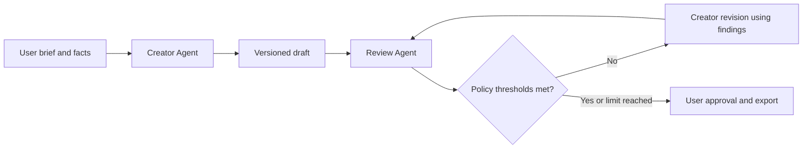

# Resume Creator Agent

## Goal

Create a concise, factual resume from verified user input while preserving the
same policy, workflow, API, and MCP boundaries used by the Resume Review Agent.
The model generates typed resume content; it never generates or executes
LaTeX. The application owns formatting, compilation, artifact access, and
cleanup.

## Architecture

The graph coordinates fixed application behavior. The Review Agent and Creator
Agent are domain-level agents. GPT, Gemini, and Luna are model services used by
those agents; they are not given control over workflow routing, filesystem
paths, LaTeX execution, or artifact access.

## Creation user flow

1. The user selects **Create resume** in either frontend.
2. They enter contact information, target role, and one verified fact per line.
3. The frontend assigns stable fact IDs and submits a `create` workflow request.
4. LangGraph validates the request and routes it only to the Creator Agent.
5. Luna returns `GeneratedResumeDocument`, a Pydantic-validated structure.
6. The Creator Agent rejects unknown or missing fact references and builds a
   claims ledger.
7. The renderer escapes all user/model text and inserts it into the approved
   Harshibar template. Unsafe links are omitted.
8. The compiler runs `pdflatex` with `-no-shell-escape` in the request workspace.
9. The artifact store copies `resume.tex` and, when compilation succeeds,
   `resume.pdf` into a random expiring artifact directory.
10. The frontend shows explicit `completed`, `partial`, or `failed` status,
    download links, grounded-claim count, missing details, and the required
    user-review reminder.

If `pdflatex` is unavailable, the result is `partial`, never falsely
`completed`, and the LaTeX source remains downloadable.

## Future revision flow

The current design leaves `revise` reserved without coupling creation to
review. A future workflow can:

That extension can reuse the typed creation document, claims ledger, shared
policy, deterministic renderer, and existing Review Agent output. Before that
loop is enabled, add durable checkpointing/versioning, explicit user approval,
revision limits, and authenticated artifact ownership.

## Operational notes

- `CREATOR_MODEL` is independent of the review and synthesis models.
- Generated content is evidence-linked, but semantic correctness still
  requires human verification.
- Artifacts currently expire locally and are not user-authenticated. Production
  deployment should use authenticated object storage and per-user ownership.
- The approved template retains its original attribution and license metadata
  in `backend/templates/resumes/harshibar/`.
